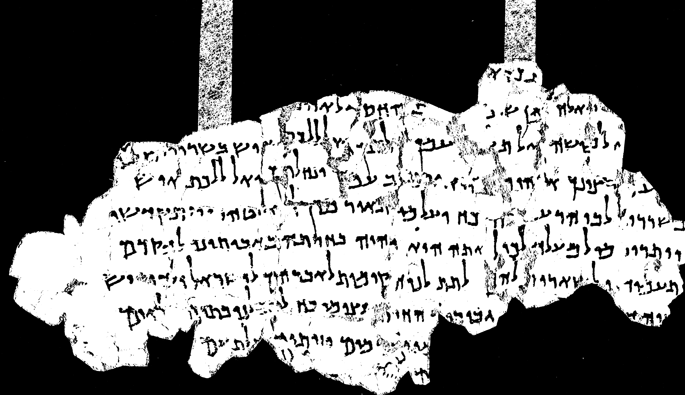
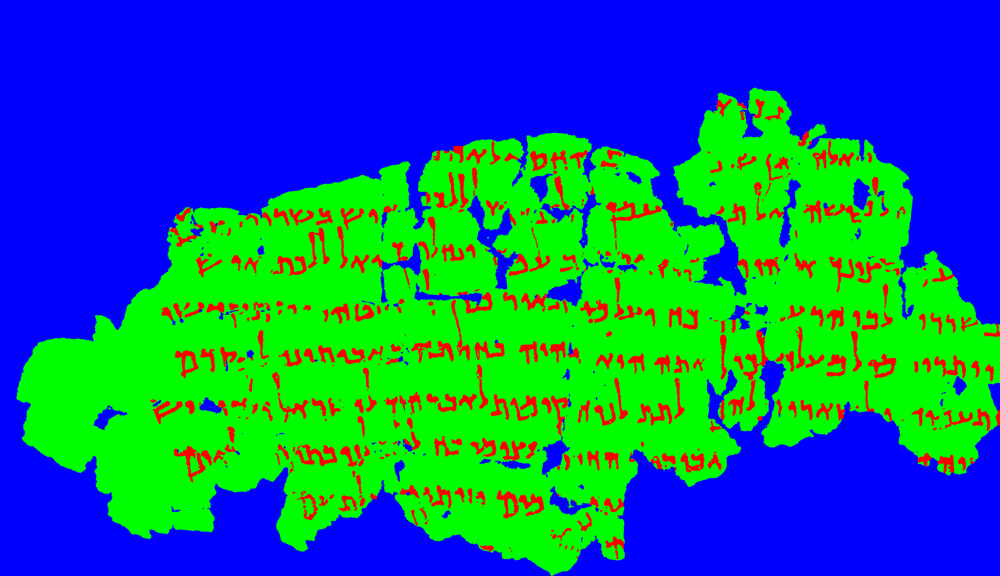

# Segmentation of Ink and Parchment in Dead Sea Scroll Fragments 	

This repository provides the code and dataset for **Segmentation of Ink and Parchment in Dead Sea Scroll Fragments**, as presented in the following preprint:

> **Berat Kurar-Barakat and Nachum Dershowitz**,  
> *Segmentation of Ink and Parchment in Dead Sea Scroll Fragments*. 
> [Read the Paper](https://www.cs.tau.ac.il/~berat/index.html)

---

## Overview

This repository contains the source code of Multispectral Thresholding and Energy Minimization (MTEM) method and the Qumran Segmentation Dataset (QSD) for segmenting ink and parchment regions in multispectral images of Dead Sea Scroll fragments.

---

## Multispectral Thresholding and Energy Minimization (MTEM)

Addresses key difficulties in historical manuscript segmentation:
  - Low contrast between black ink and black background.
  - Low contrast between black ink and darkened parchment.
  - Document degradation and noise in the images.

---

## Qumran Segmentation Dataset (QSD)

Includes:
- Multispectral images from 20 Dead Sea Scroll fragments.
- Full-color images, first-band images, last-band images, and normalized versions of the last-band images.
- Pixel-level annotations for evaluating segmentation accuracy.

**Download**: [QSD Link](https://github.com/TAU-CH/segmentation_of_ink_and_parchment_in_dead_sea_scroll_fragments/releases/download/v1/QSD.zip)

---

## Results

### Quantitative Performance of MTEM

| Method               | IoU    | Precision | Recall  | F1-Score |
|----------------------|--------|-----------|---------|----------|
| MTEM (Ink)           | 0.6713 | 0.8935    | 0.7029  | 0.7676   |
| MTEM (Parchment)     | 0.9764 | 0.9945    | 0.9818  | 0.9877   |
| Otsu (Parchment)     | 0.5642 | 0.5892    | 0.9460  | 0.6919   |

### Visual Results

Below is a comparison of the original image, Otsu segmentation, and MTEM segmentation for a Dead Sea Scroll fragment.

### Original Image

### Otsu Segmentation

### MTEM Segmentation

---
